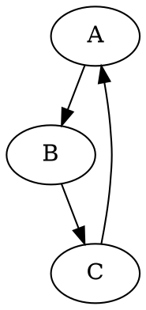
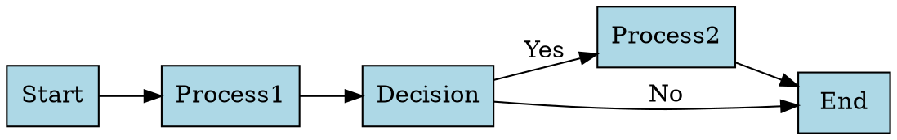
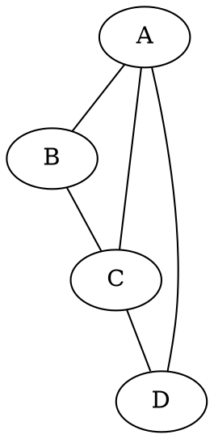

# Graphviz Test

This file tests Graphviz rendering.

## Simple Graph

```dot
digraph G {
  A -> B;
  B -> C;
  C -> A;
}
```

## More Complex Graph

```dot
digraph Complex {
  rankdir=LR;
  node [shape=box, style=filled, fillcolor=lightblue];
  
  Start -> Process1;
  Process1 -> Decision;
  Decision -> Process2 [label="Yes"];
  Decision -> End [label="No"];
  Process2 -> End;
}
```

## Undirected Graph

```dot
graph G {
  A -- B;
  B -- C;
  C -- D;
  D -- A;
  A -- C;
}
```
