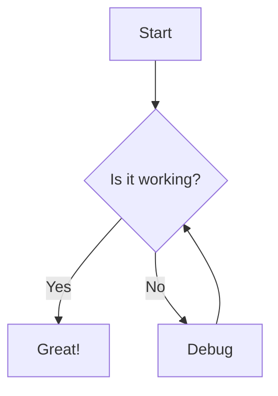

# Markdown Styling Test

This document tests all GitHub-style markdown features.

## Headings

### Level 3 Heading
#### Level 4 Heading
##### Level 5 Heading
###### Level 6 Heading

## Paragraphs and Text

This is a regular paragraph with **bold text**, *italic text*, and `inline code`. You can also use ~~strikethrough~~ text.

Here's a second paragraph with a [link to GitHub](https://github.com).

## Lists

### Unordered List
- First item
- Second item
  - Nested item
  - Another nested item
- Third item

### Ordered List
1. First step
2. Second step
3. Third step

### Task List
- [x] Completed task
- [ ] Incomplete task
- [ ] Another incomplete task

## Blockquotes

> This is a blockquote.
> It can span multiple lines.
>
> And have multiple paragraphs.

## Code Blocks

Inline code: `const x = 42;`

```javascript
function greet(name) {
  console.log(`Hello, ${name}!`);
  return true;
}
```

```python
def fibonacci(n):
    if n <= 1:
        return n
    return fibonacci(n-1) + fibonacci(n-2)
```

## Tables

| Feature | Status | Priority |
|---------|--------|----------|
| Headings | ✓ | High |
| Code blocks | ✓ | High |
| Tables | ✓ | Medium |
| Math | ✓ | Low |

## Math (KaTeX)

Inline math: $E = mc^2$

Block math:

$$
\int_0^\infty e^{-x^2} dx = \frac{\sqrt{\pi}}{2}
$$

$$
\sum_{i=1}^{n} i = \frac{n(n+1)}{2}
$$

## Mermaid Diagram



## Horizontal Rule

---

## Footnotes

Here's a sentence with a footnote[^1].

[^1]: This is the footnote content.

## End

This concludes the styling test.
